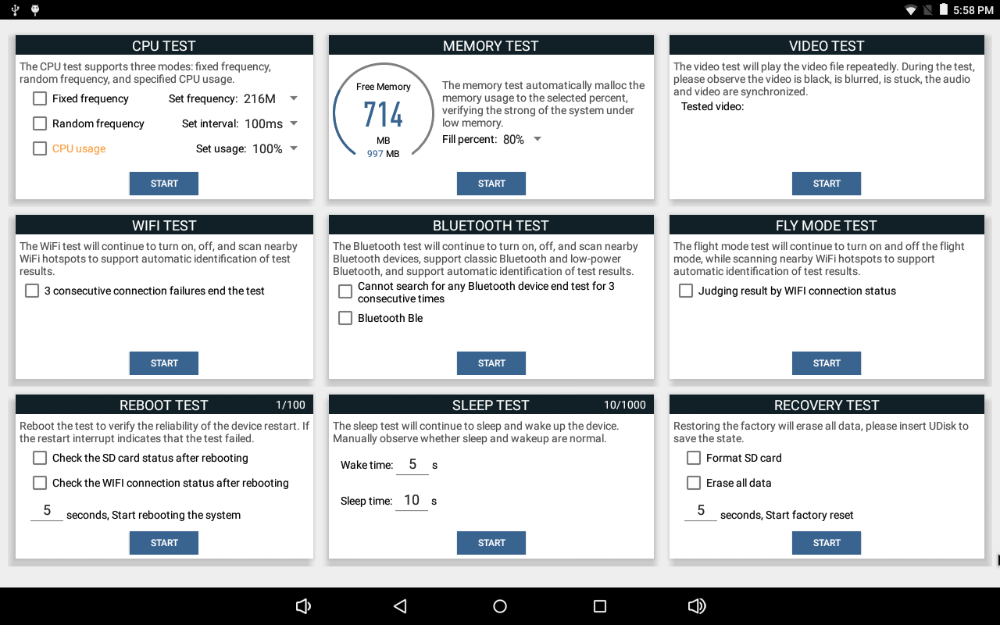
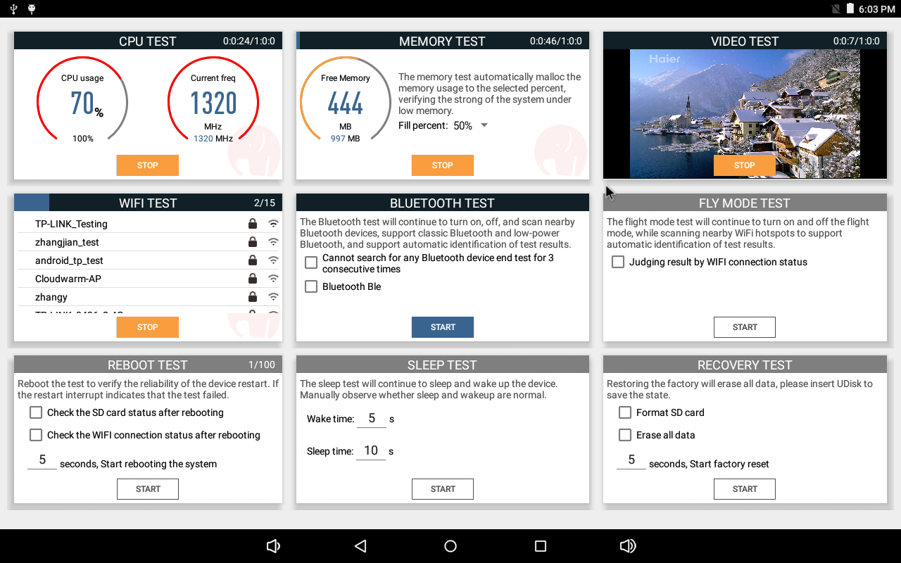

# AndroidStressTest

This is an Android system stress test app that verifies the reliability of the main modules of the system. It is suitable for Android hardware manufacturers and supports the stress test of the following modules:

* CPU test
* Memory test
* Video test
* WIFI test
* Bluetooth test
* Flight mode test
* Restart test
* Sleep test
* Restore factory test
* Time power-on/off test

## Preview

## Using AndroidStressTest in your device
1. Download
2. System signature
3. Installation

System signature:

	$java -jar SignApk.jar platform.x509.pem platform.pk8 AndroidStressTest.apk AndroidStressTest_signed.apk

NOTE:
* System permissions are required for tests such as rebooting and restoring the factory, because system signature is required
* Because the test of restarting and restoring the factory needs to be booted from the boot, and some devices prohibit the booting of the third-party APP, you can push this APP to System/app to solve it.

## Developed By
* ayst.shen@foxmail.com

## License
	Copyright 2019 Bob Shen.

	Licensed under the Apache License, Version 2.0 (the "License");
	you may not use this file except in compliance with the License.
	You may obtain a copy of the License at

	http://www.apache.org/licenses/LICENSE-2.0

	Unless required by applicable law or agreed to in writing, software
	distributed under the License is distributed on an "AS IS" BASIS,
	WITHOUT WARRANTIES OR CONDITIONS OF ANY KIND, either express or implied.
	See the License for the specific language governing permissions and
	limitations under the License.
